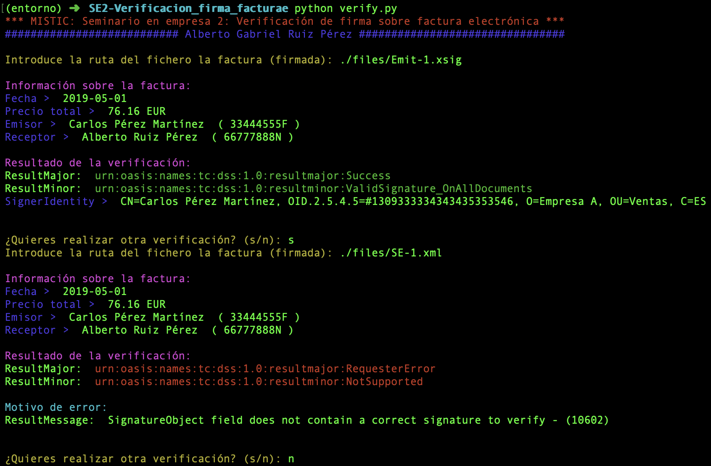

## Verificación de firmas sobre facturas electrónicas

En este ejercicio se deberá implementar una aplicación que funcione por línea de comandos
para que la Empresa B reciba facturas electrónicas firmadas y garantice la autenticidad y la
integridad de la misma.
En este caso se utilizará TrustedX eSignature de Safelayer S.A, una plataforma comercial SOAP
para la verificación de firmas digitales.

#### Pasos para su ejecución:
- Instalar dependencias necesarias:

  ```
  python3 -m venv entorno
  source entorno/bin/activate
  pip install -r requirements.txt
  ```

- Iniciar la herramienta:

  ```
  python verify.py
  ```


